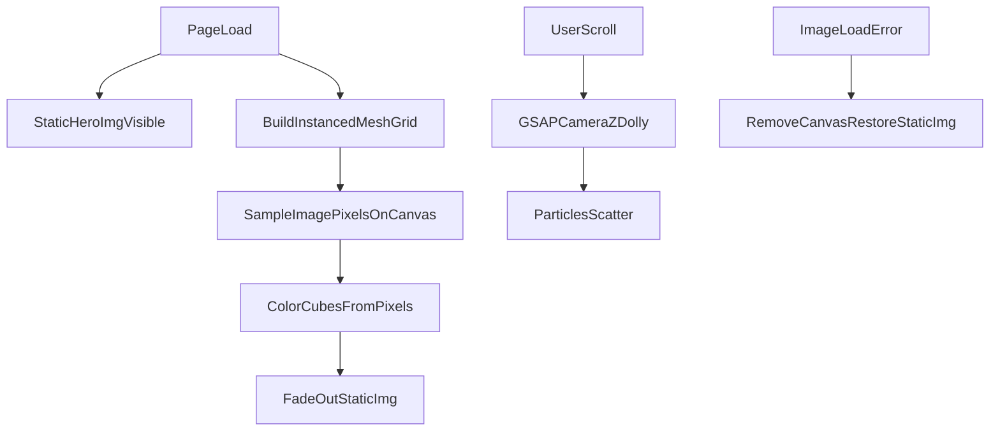
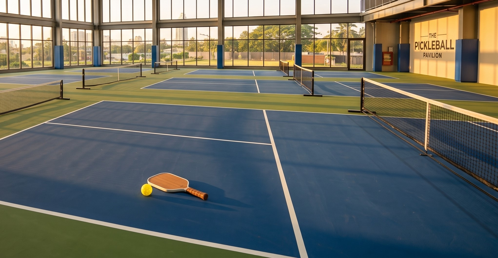

# Hero Particle Animation — Agent Implementation Spec

> **How to use this file:** Attach it to a Cursor agent chat in any project and prompt:
> *"Follow this spec exactly to add the hero particle animation."*

---

## 1. Agent Task Summary

Implement a scroll-driven hero animation that renders a photograph as a grid of tiny colored 3D cubes using Three.js `InstancedMesh`. At page load the image appears as a coherent whole filling the viewport. As the user scrolls down the page, a GSAP-driven camera dolly moves inward, breaking perspective calibration and scattering the particles apart. A static `` serves as a progressive-enhancement fallback and fades out once the particle version is ready.

### Success Criteria

- [ ] At scroll position 0, the particle image is coherent and covers the full viewport width
- [ ] Scrolling down progressively disintegrates/scatters the image across the full page scroll range
- [ ] The animation canvas is fixed, full-viewport, and does not block pointer events
- [ ] Hero text/content renders above the canvas (correct z-index stacking)
- [ ] If the hero image fails to load, the canvas is removed and the static `` remains visible
- [ ] The animation runs regardless of OS "Reduce motion" settings
- [ ] Resizing the window re-scales the mesh to continue covering the viewport
- [ ] The module is isolated in a single `hero-particles.js` file removable via one `<script>` tag

---

## 2. Architecture Overview



### Data Flow

1. **Init** — Create WebGL renderer, scene, perspective camera at `focusCameraZ`.
2. **Build mesh** — Instantiate `nCol × nRow` cubes with randomized Z depth via `positionForDepth()`.
3. **Sample image** — Draw hero image to an offscreen canvas at grid resolution; map each pixel RGB to a cube color.
4. **Cover scale** — Scale the mesh so it covers the viewport (like `object-fit: cover`).
5. **Scroll** — Map `scrollY / (pageHeight - viewportHeight)` to camera Z between `focusCameraZ` and `disperseCameraZ`.
6. **Fallback** — On image load error, skip/remove canvas; keep static image.

---

## 3. Dependencies

| Dependency | Version | Import |
|---|---|---|
| Three.js | 0.130.0 | `import * as THREE from 'https://cdn.jsdelivr.net/npm/three@0.130.0/+esm'` |
| GSAP | 3.7.0 | `import { gsap } from 'https://cdn.jsdelivr.net/npm/gsap@3.7.0/+esm'` |

**Important:**
- Use **jsDelivr** ESM imports. Do **not** use Skypack (`cdn.skypack.dev`) — it returns 404 for these packages.
- The page must be served over **HTTP** (e.g. `npx serve .`). Opening via `file://` will fail because of ES module CORS restrictions.
- No npm install or bundler is required.

---

## 4. Files to Create / Modify

| File | Action | Purpose |
|---|---|---|
| `hero-particles.js` | Create | Isolated animation module (all logic lives here) |
| `index.html` (or page template) | Modify | Add hero markup + `<script type="module">` tag |
| `style.css` (or equivalent) | Modify | Canvas positioning + hero z-index stacking |

---

## 5. Reference Implementation

### 5a. JavaScript — `hero-particles.js`

Create this file at the project root (or adjust the script `src` path accordingly).

```javascript
/**
 * HERO PARTICLE EFFECT
 *
 * Renders a hero photo as a grid of tiny coloured 3D cubes (Three.js
 * InstancedMesh). At page load the image reads as a coherent whole; scrolling
 * drives the camera inward, breaking perspective calibration and scattering
 * the particles across the full page scroll range.
 *
 * Isolated module — remove the <script> tag to disable the effect entirely.
 */

import * as THREE from 'https://cdn.jsdelivr.net/npm/three@0.130.0/+esm';
import { gsap } from 'https://cdn.jsdelivr.net/npm/gsap@3.7.0/+esm';

// ─── CONFIG — customize per project ────────────────────────────────────────
const imgUrl = 'images/hero-1.jpeg';   // path to hero image
const imgRatio = 1920 / 1080;          // image width / height
const focusCameraZ = 180;              // camera Z at scroll top (coherent image)
const disperseCameraZ = 15;            // camera Z at scroll bottom (scattered)
const instanceSize = 1;                // base cube size
const randRangeZ = 2 * focusCameraZ * 0.99; // Z-depth randomness range
const nRow = 256;                      // vertical particle count (density)
const nCol = (nRow * imgRatio) | 0;    // horizontal particle count (derived)
// ───────────────────────────────────────────────────────────────────────────

// ─── Renderer / Scene / Camera ────────────────────────────────────────────────
const renderer = new THREE.WebGLRenderer({ alpha: true });
const scene = new THREE.Scene();
const camera = new THREE.PerspectiveCamera(75, 2, 0.5, 1000);
camera.position.set(0, 0, focusCameraZ);

function positionForDepth(x, y, targetZ) {
  const h = 0.5;
  const d = focusCameraZ;
  const D = -targetZ + d;
  const H = (h / d) * D;
  const s = H / h;
  return { s, p: new THREE.Vector3(x * s, y * s, targetZ) };
}

// ─── Build mesh immediately (white cubes, coloured on image load) ───────────
const mesh = (() => {
  const sz = instanceSize;

  const geom = new THREE.BoxGeometry(sz, sz, sz).translate(0, 0, -0.5 * sz);
  const mat = new THREE.MeshBasicMaterial();
  const instancedMesh = new THREE.InstancedMesh(geom, mat, nCol * nRow);

  for (let i = 0, c = 0; i < nRow; ++i) {
    for (let j = 0; j < nCol; ++j) {
      const { p, s } = positionForDepth(
        (j - nCol / 2 + 0.5) * sz,
        (nRow / 2 - i + 0.5) * sz,
        THREE.MathUtils.randFloatSpread(randRangeZ) * sz
      );
      const m = new THREE.Matrix4()
        .setPosition(p)
        .multiply(new THREE.Matrix4().makeScale(s, s, s));
      instancedMesh.setMatrixAt(c, m);
      instancedMesh.setColorAt(c, new THREE.Color('white'));
      ++c;
    }
  }

  instancedMesh.instanceMatrix.needsUpdate = true;
  instancedMesh.instanceColor.needsUpdate = true;
  return instancedMesh;
})();
scene.add(mesh);

function applyCoverScale() {
  const vFovRad = camera.fov * (Math.PI / 180);
  const frustumHeight = 2 * focusCameraZ * Math.tan(vFovRad / 2);
  const frustumWidth = frustumHeight * camera.aspect;

  const scaleToCoverHeight = frustumHeight / nRow;
  const scaleToCoverWidth = frustumWidth / nCol;
  const coverScale = Math.max(scaleToCoverHeight, scaleToCoverWidth);

  mesh.scale.set(coverScale, coverScale, 1);
}

// ─── Load hero image, sample pixels, colour the instances ────────────────────
const img = new Image();
img.onload = () => {
  const { width, height } = img;
  const can = document.createElement('canvas');
  can.height = nRow;
  can.width = (can.height * imgRatio) | 0;
  const ctx = can.getContext('2d');
  ctx.drawImage(img, 0, 0, width, height, 0, 0, can.width, can.height);
  const { data } = ctx.getImageData(0, 0, can.width, can.height);
  const c = new THREE.Color();
  const total = data.length >> 2;
  for (let i = 0; i < total; ++i) {
    mesh.setColorAt(i, c.setRGB(data[i * 4] / 255, data[i * 4 + 1] / 255, data[i * 4 + 2] / 255));
  }
  mesh.instanceColor.needsUpdate = true;
  applyCoverScale();

  const heroBgImg = document.querySelector('.hero-bg-image');
  if (heroBgImg) {
    heroBgImg.style.transition = 'opacity 0.6s ease';
    heroBgImg.style.opacity = '0';
  }
};

img.onerror = () => {
  console.warn('[hero-particles] Could not load hero image — falling back to static hero.');
  cleanup();
};

img.crossOrigin = '';
img.src = imgUrl;

// ─── Render loop ──────────────────────────────────────────────────────────────
renderer.setAnimationLoop(() => {
  renderer.render(scene, camera);
});

// ─── Resize handler ───────────────────────────────────────────────────────────
function resize(w, h, dpr = devicePixelRatio) {
  renderer.setPixelRatio(dpr);
  renderer.setSize(w, h, false);
  camera.aspect = w / h;
  camera.updateProjectionMatrix();
  applyCoverScale();
}

function onResize() {
  resize(innerWidth, innerHeight);
}

addEventListener('resize', onResize, { passive: true });
dispatchEvent(new Event('resize'));

// ─── Mount canvas ─────────────────────────────────────────────────────────────
const canvas = renderer.domElement;
canvas.id = 'hero-particle-canvas';
document.body.prepend(canvas);

// ─── Scroll-driven camera dolly (focus → disperse across full page) ───────────
function setCamPos() {
  const H = document.documentElement.offsetHeight - window.innerHeight;
  const r = H > 0 ? window.scrollY / H : 0;
  const z = focusCameraZ + (disperseCameraZ - focusCameraZ) * r;
  gsap.killTweensOf(camera.position);
  gsap.to(camera.position, { z });
}

document.addEventListener('scroll', setCamPos, { passive: true });
setCamPos();

// ─── Cleanup helper (used if image fails to load) ─────────────────────────────
function cleanup() {
  renderer.setAnimationLoop(null);
  document.removeEventListener('scroll', setCamPos);
  removeEventListener('resize', onResize);
  if (canvas.parentNode) canvas.parentNode.removeChild(canvas);
  const heroBgImg = document.querySelector('.hero-bg-image');
  if (heroBgImg) heroBgImg.style.opacity = '1';
}
```

### 5b. HTML — minimal hero section

Add inside `<body>`, typically as the first content section. Adjust text/classes to match the host project.

```html
<section id="hero" class="hero-section" aria-label="Welcome">
  <div class="hero-bg-container">
    
  </div>
  <div class="hero-content">
    <h1>Your Headline</h1>
    <p>Your subheadline or CTA copy.</p>
  </div>
</section>

<!-- Additional page content below the hero -->
<main>
  <!-- sections... -->
</main>

<!-- Before closing </body> — must be type="module" -->
<script type="module" src="hero-particles.js"></script>
```

**Required conventions:**
- The fallback image **must** have class `hero-bg-image` (the JS queries this selector to fade it out / restore it).
- The script tag **must** use `type="module"`.
- Place enough content below the hero so the page is scrollable (the disperse effect maps to full page scroll range).

### 5c. CSS — required styles

Add to the project's stylesheet. These are the minimum rules for correct stacking and layout.

```css
/* Fixed full-viewport particle canvas (injected by hero-particles.js) */
#hero-particle-canvas {
  position: fixed;
  inset: 0;
  z-index: 0;
  pointer-events: none;
  transition: opacity 0.1s linear;
}

/* Hero section — sits above the fixed canvas */
.hero-section {
  position: relative;
  z-index: 2;
  height: 100vh;
  min-height: 650px;
  display: flex;
  align-items: center;
  justify-content: center;
  text-align: center;
  overflow: hidden;
}

.hero-bg-container {
  position: absolute;
  top: 0;
  left: 0;
  width: 100%;
  height: 100%;
  z-index: 1;
}

.hero-bg-image {
  width: 100%;
  height: 100%;
  object-fit: cover;
}

.hero-content {
  position: relative;
  z-index: 3;
}
```

**Z-index stacking (bottom to top):**

| Layer | z-index | Element |
|---|---|---|
| Particle canvas | 0 | `#hero-particle-canvas` (fixed, injected into `<body>`) |
| Static hero image | 1 | `.hero-bg-image` inside `.hero-bg-container` |
| Hero section shell | 2 | `.hero-section` |
| Hero text/CTA | 3 | `.hero-content` |

---

## 6. Configuration Knobs

All constants live in the `CONFIG` block at the top of `hero-particles.js`.

| Constant | Default | What it controls | Tradeoffs |
|---|---|---|---|
| `imgUrl` | `'images/hero-1.jpeg'` | Path to the hero photograph | Must be reachable; same image as the static `` fallback |
| `imgRatio` | `1920 / 1080` | Image aspect ratio (width ÷ height) | Must match the actual image dimensions or the grid will be stretched |
| `focusCameraZ` | `180` | Camera distance at scroll top | Higher = more "zoomed out", image looks more coherent |
| `disperseCameraZ` | `15` | Camera distance at scroll bottom | Lower = more scattered/disintegrated at full scroll |
| `instanceSize` | `1` | Base cube geometry size | Usually leave at 1; scale is handled by `applyCoverScale()` |
| `randRangeZ` | `2 * focusCameraZ * 0.99` | Random Z spread per cube | Higher = more depth variation, more dramatic scatter |
| `nRow` | `256` | Vertical particle count | Higher = sharper image, more GPU load. 256 × ~455 ≈ 116k instances |
| `nCol` | `(nRow * imgRatio) \| 0` | Horizontal particle count (auto) | Derived from `nRow` and `imgRatio`; do not set manually |

### Performance guidance

- `nRow = 256` produces a sharp result on modern desktops but is heavy on low-end mobile.
- For mobile-friendly projects, try `nRow = 128` (≈ 29k instances) or `nRow = 192`.
- The renderer uses `{ alpha: true }` so the canvas background is transparent.

---

## 7. Integration Checklist

Follow these steps in order:

1. **Add the hero image** to the project (e.g. `images/hero.jpg`).
2. **Set `imgUrl` and `imgRatio`** in `hero-particles.js` to match the image path and dimensions.
3. **Create `hero-particles.js`** — copy the full reference implementation from section 5a.
4. **Add the HTML hero section** — copy from section 5b; ensure the `` has class `hero-bg-image`.
5. **Add the CSS rules** — copy from section 5c into the project stylesheet.
6. **Add the module script tag** — `<script type="module" src="hero-particles.js"></script>` before `</body>`.
7. **Ensure scrollable content** exists below the hero (the animation maps to full page scroll).
8. **Verify z-index** — hero text must be above the canvas; no other global styles should override hero content visibility.
9. **Serve locally** — run `npx serve .` and open `http://localhost:3000` (not `file://`).
10. **Run verification steps** from section 10 below.

---

## 8. Accessibility and Fallbacks

### Reduced motion

The animation **always runs** — there is no `prefers-reduced-motion` guard. This is intentional for portfolio/demo sites where the particle effect is a core visual feature. The static `` fallback is only used when JavaScript is disabled or the hero image fails to load.

If you need to respect reduced motion in a production site, wrap the module in a `prefers-reduced-motion` check or use instant camera updates instead of GSAP tweens (see optional notes in section 9).

### Image load failure

If the image cannot be loaded, `img.onerror` calls `cleanup()` which:
- Stops the render loop
- Removes scroll/resize listeners
- Removes the canvas from the DOM
- Restores the static hero image to `opacity: 1`

### Progressive enhancement

The static `` is always in the HTML regardless of JS. Users without WebGL or without JS see the photograph.

### CORS

`img.crossOrigin = ''` is set before loading. If the image is hosted on a different origin without CORS headers, canvas pixel sampling (`getImageData`) will fail silently. Keep the hero image on the same origin or ensure CORS headers are present.

---

## 9. Common Pitfalls

| Pitfall | Symptom | Fix |
|---|---|---|
| Opening via `file://` | Module import errors, blank canvas | Serve over HTTP: `npx serve .` |
| Using Skypack CDN | 404 on Three.js / GSAP imports | Use jsDelivr URLs as specified |
| Missing `type="module"` on script tag | `import` syntax error | Add `type="module"` to the `<script>` tag |
| Wrong `imgRatio` | Stretched or squashed particle image | Set to actual image width ÷ height |
| No scrollable content below hero | Scroll has no effect on particles | Add enough page content to enable scrolling |
| Global `main { color: white }` CSS | White text on white backgrounds in other page areas | Scope color rules to the hero only, or add explicit `color` on content sections |
| Canvas bleeding through footer | Particle cubes visible behind footer content | Give footer `position: relative; z-index: 2` (optional, not part of core spec) |
| Mismatched image paths | Static img shows, particles never color | Ensure `imgUrl` in JS matches the `` in HTML |
| Class name mismatch | Static image never fades out | The fallback image must use class `hero-bg-image` exactly |

---

## 10. Verification Steps

Run these checks after implementation:

| # | Test | Expected result |
|---|---|---|
| 1 | Load page at scroll position 0 | Coherent hero image fills viewport width |
| 2 | Scroll slowly through the page | Particles progressively scatter/disintegrate |
| 3 | Scroll to bottom of page | Maximum scatter (camera at `disperseCameraZ`) |
| 4 | Resize browser window | Image re-covers viewport without gaps |
| 5 | Break the image path (wrong `imgUrl`) | Canvas removed, static `` stays visible |
| 6 | Disable JavaScript | Static `` hero displays normally |
| 7 | Check hero text/CTA | Text is readable and above the particle canvas |
| 8 | Scroll on mobile / narrow viewport | Cover scaling works, no horizontal overflow from canvas |
| 9 | Check browser console | No errors from Three.js, GSAP, or CORS |

---

## Out of Scope

This spec covers the **core animation only**. The following features from the original reference site are intentionally excluded:

- Full-page dark overlay (`#particle-dark-overlay`)
- White text color overrides on `main` for dark-backed sections
- Footer z-index stacking fix
- Ken Burns zoom animation on `.hero-bg-image`
- Site-specific content sections (booking, pricing, etc.)

If the host project needs particles visible behind all page content with a dark tint, those features can be added as a follow-up.
